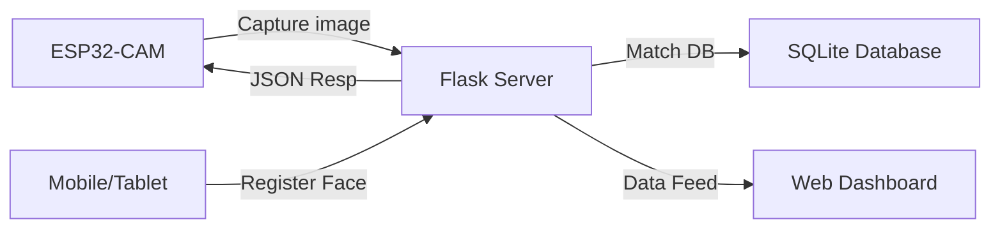

# 📸 ESP32-CAM Face Recognition Attendance System

A modern, standalone attendance tracking solution combining ESP32-CAM's visual intelligence with a powerful Python Flask backend.

✨ **Features**

*   🆔 **Real-time Face Recognition**: Instant identity verification using `face_recognition` (dlib).
*   🌐 **Live Dashboard**: Monitor attendance logs and manage users via a sleek web interface.
*   📸 **Remote Face Registration**: Register new users directly from any browser-enabled device.
*   🚦 **Hardware Feedback**: Integrated LED and Buzzer support for instant success/fail notification.
*   📟 **LCD Support**: Real-time status display on I2C LCD (16x2 or 20x4).
*   🔐 **Secure Communication**: API token-based authentication for device-to-server security.
*   📡 **Offline Resilience**: Local logging capability even when the network is intermittent.

🎯 **System Architecture**



**ESP32-CAM**: Handles image capture and hardware feedback.
**Flask Backend**: Manages logic, face embeddings, and the API layer.
**Web Dashboard**: User management and attendance monitoring.

🚀 **Getting Started**

### Prerequisites

*   Python 3.10 or higher
*   Arduino IDE (for ESP32 firmware)
*   ESP32-CAM Development Board
*   I2C LCD Display (Optional)

### Installation

1.  **Clone the Repository**
    ```bash
    git clone https://github.com/yourusername/Attendance.git
    cd Attendance
    ```

2.  **Set Up Backend**
    ```bash
    python -m venv venv
    source venv/bin/activate
    pip install -r backend/requirements.txt
    ```

3.  **Start the Server**
    ```bash
    cd backend
    python app.py
    ```
    Access the dashboard at `http://localhost:5000` (Default: `admin`/`admin123`).

### Hardware Setup

1.  **Configure ESP32-CAM**
    *   Open `firmware/esp32cam_attendance/esp32cam_attendance.ino`
    *   Set `WIFI_SSID`, `WIFI_PASS`, and your server's `SERVER_URL`.
    *   Ensure `API_TOKEN` matches the server configuration.

2.  **Flash Firmware**
    *   Select **AI Thinker ESP32-CAM** board in Arduino IDE.
    *   Upload the code to your device.

🛠️ **Hardware Setup**

### Pin Mappings

| Component | Pin (GPIO) | Notes |
| :--- | :--- | :--- |
| **Success LED** | 2 | Green LED (Active HIGH) |
| **Red LED** | 12 | Failure Indicator |
| **Trigger Button** | 13 | Manual Capture (Active LOW) |
| **I2C SDA** | 14 | LCD Data |
| **I2C SCL** | 15 | LCD Clock |
| **Back LED** | 33 | Status Indicator (Active LOW) |

> [!WARNING]
> Ensure a power supply of at least **2A @ 5V** to prevent brownouts during camera activity.

📡 **Communication Protocol**

The system uses a secured HTTP/JSON interface:

*   **Recognition**: `POST /recognize_face` (Multipart JPEGs)
*   **Heartbeat**: `GET /health`
*   **API Security**: Bearer Token required for all device endpoints.

📚 **Resources**

### Internal Documentation
*   📄 **[Architecture](ARCHITECTURE.md)**: Deep dive into the system design and data flow.
*   🚀 **[Deployment Guide](DEPLOYMENT.md)**: Steps for production deployment and cloud setup.
*   📊 **[Data Management](DATA_MANAGEMENT.md)**: Information on how face embeddings and logs are stored.
*   🔐 **[Security](SECURITY.md)**: Best practices for securing your AIO keys and server.

### External Links
*   🛠️ **[ESP32-CAM Guide](https://randomnerdtutorials.com/esp32-cam-video-streaming-face-recognition-arduino-ide/)**: Comprehensive guide for hardware setup.
*   🧠 **[Face Recognition library](https://github.com/ageitgey/face_recognition)**: Documentation for the core recognition engine.
*   📦 **[ArduinoJson](https://arduinojson.org/)**: Essential library for parsing server responses.
*   🐍 **[Flask Documentation](https://flask.palletsprojects.com/)**: Documentation for the backend framework.

🧪 **References**

*   **Dlib (C++ Library)**: The powerhouse behind the HOG and Deep Learning models used for face detection. [Dlib.net](http://dlib.net/)
*   **OpenCV**: Used for image preprocessing and visualization within the backend. [OpenCV.org](https://opencv.org/)
*   **Face Recognition Paper**: *FaceNet: A Unified Embedding for Face Recognition and Clustering* (Schroff et al.) – The foundation for modern embedding-based recognition.
*   **Espressif ESP-IDF**: The official development framework for ESP32, providing the low-level camera and networking APIs.
🤝 **Contributing**

1.  Fork the project
2.  Create your feature branch (`git checkout -b feature/AmazingFeature`)
3.  Commit your changes (`git commit -m 'Add some AmazingFeature'`)
4.  Push to the branch (`git push origin feature/AmazingFeature`)
5.  Open a Pull Request

📝 **License**

This project is licensed under the MIT License - see the [LICENSE](LICENSE) file for details.

🙏 **Acknowledgments**

*   `face_recognition` library by Adam Geitgey.
*   Espressif Systems for the incredible ESP32 platform.
*   Flask framework team for the lightweight backend.
